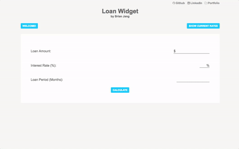
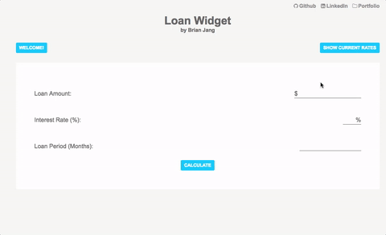

# Loan Widget

"Loan Widget" is a widget that helps students visualize loan repayment. "Loan Widget" is built using AngularJS and Node.JS.

[Loan Widget Live][loan-widget]

[loan-widget]: https://loan-widget.herokuapp.com/



## Features and Implementation

### Fetching Interest Rates

  Current interest rates are fetched using `$http`'s `get` request to the node backend. Instead of populating the controller, through the use of the service factory function, this request is stored as a service:

```JavaScript
app.factory("intRates", ["$http", ($http) => {
  return {
    get: () => {
      return $http.get("/interest-rates");
    }
  };
}]);
```

### Form
  Using `ng-model`, user inputs are saved to the `MainCtrl` controller inside `$scope.loanData`. To restrict inputs to number and only certain range of values, `input` tags have `type="number"`, and `min` and `max` limits.

  ```html
    <input type="number" min="0" ng-model="loanData.loanAmount">
  ```

  In addition, there's a simple error message pop up if users do not populate all the given input fields:

  

### Chart
  `Angular-Chart` is used to create reactive and responsive bar chart using `AngularJS` and `Chart.js`.

  `CALCULATE` submit button binds `MainCtrl`'s `handleSubmit` function, which handles the user input data, on `ng-click`.

  ```html
  <button ... ng-click="handleSubmit()">Calculate</button>
  ```

  `handleSubmit` function uses user input data and prepares data attributes required for `Angular-Chart` to create the bar graph.

  

### Responsive Design

  Used Flexbox to make the app more responsive.
  Also implemented break point using `@media` query.

  

#### Future Features

- [ ] Implement another visual chart for the breakdown of the monthly payments into principal and interest. (Already have those breakdowns available through `handleSubmit` function. Just need to think of a way to integrate seamlessly.)
- [ ] Add more styling.
